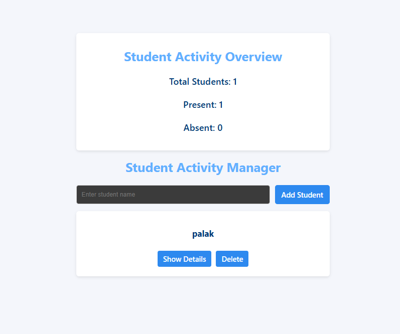

# Student Activity Manager

## About Project

Student Activity Manager is a simple React application.  
It helps manage a list of students and their attendance.

Users can:
- Add students
- View the student list
- Toggle student details
- Mark students as present or absent
- Delete students

The interface updates instantly using React state and events.

---

## Folder Structure

- src/
  - components/
    - StudentForm.jsx
    - StudentList.jsx
    - StudentCard.jsx
  - App.jsx
  - style.css

---

## What I Learned

- Events & Handlers
- Passing Arguments to Handlers
- Conditional Rendering
- Refs
- Fragments
- State (useState)
- Props
- Component Structure
- Lists (map, keys)
- ES6 Features  
  - Arrow Functions  
  - Spread Operator  
  - Destructuring

---

## ScreenShot

